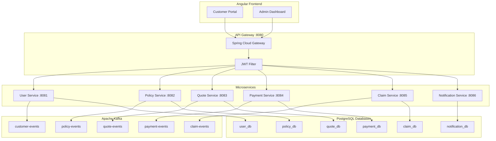
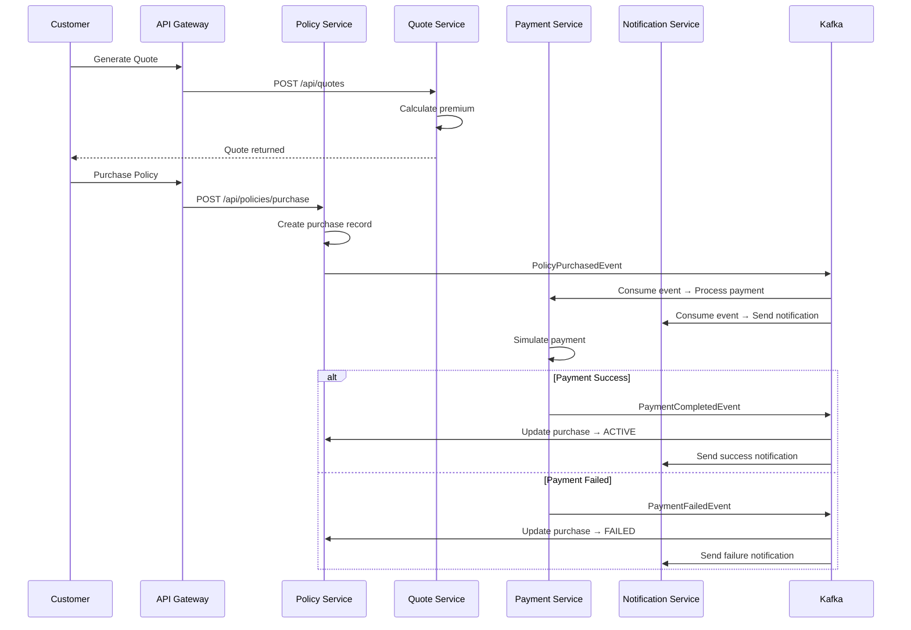
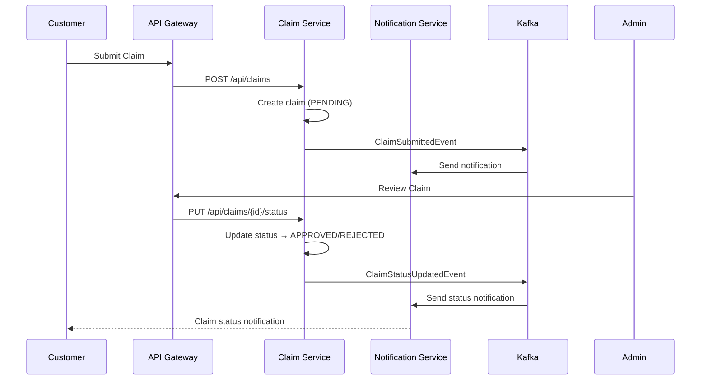
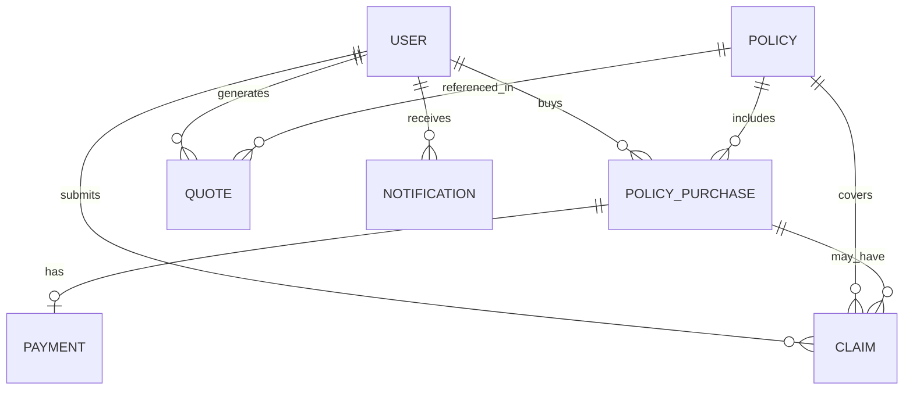

# 🛡️ Insurance Management System

A full-stack, portfolio-level **Insurance Management System** built with **Java Spring Boot Microservices**, **Apache Kafka**, **Angular**, and **PostgreSQL**. Designed to demonstrate job-ready skills as a Java Full Stack Developer.

---

## 📋 Overview

This application provides a complete insurance management platform with two roles: **Customer** and **Admin**. Customers can browse policies, generate quotes, purchase insurance, make payments, submit claims, and track their status. Admins can manage all entities, review claims, and monitor system statistics.

---

## 🎯 Business Problem

Insurance companies need digital platforms to manage policies, process payments, handle claims, and communicate with customers. This system simulates a modern insurance SaaS platform with production-style architecture.

---

## ✨ Features

### Customer Portal
- 🔐 Registration & Login with JWT authentication
- 📊 Personalized dashboard with statistics
- 📋 Browse & filter insurance policies (Auto, Home, Health, Life, Travel)
- 💰 Generate personalized quotes with premium calculation
- 🛒 Purchase policies with simulated payment
- 💳 Credit/Debit card payment simulation
- 📝 Submit & track insurance claims
- 🔔 Real-time notifications via Kafka

### Admin Dashboard
- 📊 System overview with key metrics
- 👥 Customer management (search, filter, activate/deactivate)
- 📋 Policy CRUD operations
- 💰 View all quotes
- 🛒 Monitor all purchases
- 💳 View all payments
- 📝 Claim management with status transitions

---

## 🏗️ Architecture

### High-Level Architecture



### Communication Patterns

| Pattern | Used For | Why |
|---------|----------|-----|
| **REST (Synchronous)** | Policy lookup, quote generation, user auth | Immediate response required |
| **Kafka (Asynchronous)** | Policy purchase, payment events, claims, notifications | Decoupled, reliable, scalable |

---

## 🔧 Technology Stack

| Layer | Technology |
|-------|-----------|
| **Frontend** | Angular 19, TypeScript, SCSS |
| **Backend** | Java 17, Spring Boot 3.2, Spring Security |
| **Messaging** | Apache Kafka |
| **Database** | PostgreSQL 16 |
| **API Docs** | SpringDoc OpenAPI (Swagger) |
| **Auth** | JWT (JSON Web Tokens) |
| **Build** | Maven 3.9, npm |
| **Containerization** | Docker, Docker Compose |
| **Testing** | JUnit 5, Mockito |

---

## 📡 Kafka Architecture

### Event Topics

| Topic | Producer | Consumer(s) | Purpose |
|-------|----------|-------------|----------|
| customer-events | User Service | Notification | New customer registered |
| quote-events | Quote Service | Notification | Quote generated |
| policy-events | Policy Service | Payment, Notification | Policy purchased |
| payment-events | Payment Service | Policy, Notification | Payment success/failure |
| claim-events | Claim Service | Notification | Claim submitted/updated |

### Policy Purchase Flow



### Claim Processing Flow



---

## 🗄️ Database Design



### Database Schemas

| Database | Tables |
|----------|--------|
| user_db | users |
| policy_db | insurance_policies, policy_purchases |
| quote_db | quotes |
| payment_db | payments |
| claim_db | claims |
| notification_db | notifications |

---

## 🚀 Local Setup

### Prerequisites
- Java 17+
- Node.js 22+
- PostgreSQL 16+
- Apache Kafka
- Maven 3.9+

### Backend Setup
```bash
cd backend
mvn clean install
# Start each service on its respective port
mvn spring-boot:run -pl user-service
mvn spring-boot:run -pl policy-service
mvn spring-boot:run -pl quote-service
mvn spring-boot:run -pl payment-service
mvn spring-boot:run -pl claim-service
mvn spring-boot:run -pl notification-service
mvn spring-boot:run -pl api-gateway
```

### Frontend Setup
```bash
cd insurance-ui
npm install
ng serve
```

---

## 🐳 Docker Setup

```bash
# Start all services
docker-compose up -d

# View logs
docker-compose logs -f

# Stop all services
docker-compose down
```

---

## 🌐 API Endpoints

### Authentication (User Service - :8081)
| Method | Endpoint | Description |
|--------|----------|-------------|
| POST | `/api/auth/register` | Register new customer |
| POST | `/api/auth/login` | Login |
| GET | `/api/users/me` | Get current user profile |

### Policies (Policy Service - :8082)
| Method | Endpoint | Description |
|--------|----------|-------------|
| GET | `/api/policies` | Get all policies |
| GET | `/api/policies/{id}` | Get policy by ID |
| POST | `/api/policies` | Create policy (admin) |
| PUT | `/api/policies/{id}` | Update policy (admin) |
| DELETE | `/api/policies/{id}` | Delete policy (admin) |
| POST | `/api/policies/purchase` | Purchase policy |

### Quotes (Quote Service - :8083)
| Method | Endpoint | Description |
|--------|----------|-------------|
| POST | `/api/quotes` | Generate quote |
| GET | `/api/quotes/{id}` | Get quote by ID |

### Payments (Payment Service - :8084)
| Method | Endpoint | Description |
|--------|----------|-------------|
| POST | `/api/payments` | Process payment |
| GET | `/api/payments/{id}` | Get payment by ID |

### Claims (Claim Service - :8085)
| Method | Endpoint | Description |
|--------|----------|-------------|
| POST | `/api/claims` | Submit claim |
| GET | `/api/claims/{id}` | Get claim by ID |
| PUT | `/api/claims/{id}/status` | Update claim status |

### Notifications (Notification Service - :8086)
| Method | Endpoint | Description |
|--------|----------|-------------|
| GET | `/api/notifications/user/{userId}` | Get notifications |

---

## 🔐 Authentication

- **JWT-based** authentication with BCrypt password hashing
- **Role-based** authorization: `CUSTOMER` and `ADMIN`
- Tokens expire after 24 hours
- Passwords are never stored in plaintext

---

## 🧪 Testing

```bash
# Run all tests
cd backend
mvn test

# Run specific service tests
mvn test -pl user-service
mvn test -pl policy-service
```

### Test Coverage
- Unit tests for all service layers
- Controller tests with MockMvc
- Service tests with Mockito
- Premium calculation logic tests

---

## 📊 Premium Calculation Formula

```
Premium = Base Premium × Coverage Factor × Age Factor × Risk Factor × Duration Factor

Coverage Factor = coverageAmount / 100,000
Age Factor:
  - 18-25: 1.3
  - 26-35: 1.0
  - 36-45: 1.2
  - 46-55: 1.5
  - 56-65: 2.0
  - 65+:   2.5
Risk Factor: Based on coverage-to-base-premium ratio
Duration Factor: months / 12
```

---

## 🔑 Demo Credentials

| Role | Email | Password |
|------|-------|----------|
| Admin | admin@example.com | Demo@12345 |
| Customer | customer1@example.com | Demo@12345 |
| Customer | customer2@example.com | Demo@12345 |

---

## 📁 Project Structure

```
Insurance/
├── backend/
│   ├── pom.xml                    # Parent POM
│   ├── common/                    # Shared DTOs, events, exceptions
│   ├── api-gateway/               # Spring Cloud Gateway
│   ├── user-service/              # Authentication & user management
│   ├── policy-service/            # Insurance policies & purchases
│   ├── quote-service/             # Quote generation & premium calculation
│   ├── payment-service/           # Simulated payment processing
│   ├── claim-service/             # Claims management
│   └── notification-service/      # Kafka-driven notifications
├── insurance-ui/                  # Angular frontend
├── frontend/                      # Docker config for frontend
├── docker-compose.yml
├── .env.example
└── README.md
```

---

## 📄 Documentation

- [Interview Guide](docs/INTERVIEW_GUIDE.md)
- [Resume Project Description](docs/RESUME_PROJECT_DESCRIPTION.md)

---

## 📬 API Documentation

Swagger UI is available at each service:
- User Service: `http://localhost:8081/swagger-ui.html`
- Policy Service: `http://localhost:8082/swagger-ui.html`
- Quote Service: `http://localhost:8083/swagger-ui.html`
- Payment Service: `http://localhost:8084/swagger-ui.html`
- Claim Service: `http://localhost:8085/swagger-ui.html`
- Notification Service: `http://localhost:8086/swagger-ui.html`

---

## 💡 Interview Topics

This project demonstrates understanding of:

### Architecture
- **Why microservices?** Independent deployment, team autonomy, technology flexibility
- **Why Kafka?** Async communication for policy purchases, payments, and claims
- **Why REST + Kafka?** REST for sync operations (quotes, queries), Kafka for async events

### Key Workflows
- **Policy purchase:** Browse → Quote → Purchase → Payment → Activate
- **Claim process:** Submit → Review → Approve/Reject → Notify customer
- **Payment failure:** Payment fails → Kafka event → Update purchase status → Notify

### Technical Concepts
- JWT authentication with role-based access (Customer/Admin)
- Database-per-service pattern with eventual consistency
- Premium calculation with multi-factor formula
- Event-driven architecture with Kafka consumer groups
- API Gateway routing and cross-cutting concerns

See [docs/INTERVIEW_GUIDE.md](docs/INTERVIEW_GUIDE.md) for detailed Q&A.

---

## 🚧 Future Enhancements

- [ ] Email notifications via SMTP
- [ ] PDF policy document generation
- [ ] Payment gateway integration (Stripe)
- [ ] Eureka service discovery
- [ ] Circuit breaker pattern (Resilience4j)
- [ ] Distributed tracing (Sleuth + Zipkin)
- [ ] Elasticsearch for full-text search
- [ ] WebSocket for real-time notifications
- [ ] Unit & integration tests for Angular
- [ ] CI/CD pipeline with GitHub Actions

---

## 👨‍💻 Author

Built as a portfolio project demonstrating skills in:
- Java / Spring Boot / Microservices
- Apache Kafka / Event-Driven Architecture
- Angular / TypeScript
- PostgreSQL / Database Design
- Docker / DevOps
- REST API Design / Security

---

## 📝 License

This project is for educational/portfolio purposes only.
